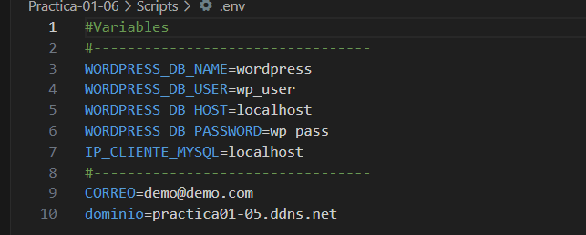

### Implantación de WordPress | Directorio raíz y su propio directorio

Para esta práctica se llevará a cabo la implanatación de Wordpress tanto en el directorio raíz de **Apache** `/var/www/html`, como en su propi directorio `/var/www/html/wordpress`.

Para ello, tendremos implementado el siguiente esquema de directorios:

``````
├── README.md
├── conf
│   └── 000-default.conf
├── htaccess
│   └── .htaccess
└── scripts
    ├── .env
    ├── install_lamp.sh
    ├── setup_letsencrypt_https.sh
    ├── deploy_wordpress_root_directory.sh    
    └── deploy_wordpress_own_directory.sh
``````
(Me ahorro explicar los pasos que hay que seguir para realizar cosas que he documentado en prácticas anteriores.)

## 1. Despliegue de Wordpress en directorio raíz

Primeramente me traeré el codigo fuente del **Wordpress** en su ultima versión, pero antes de ello **eliminaré descargas previas**:

```
rm -rf /tmp/latest.tar.gz
```

```
wget http://wordpress.org/latest.tar.gz -P /tmp
```

Despues de ello,  Descomprimimos el archivo **.tar.gz** que acabamos de descargar con el comando **tar**:

```
tar -xzvf /tmp/latest.tar.gz -C /tmp
```
Para que no se de algún tipo de conflicto se eliminarán las  instalaciones previas de **Wordpress**:

```
rm -rf /var/www/html/*
```

Y mediante el siguiente comando movemos hacia el **directorio raíz** el contenido que se descomprimió en la carpeta **Wordpress** en **/tmp**:

```
mv -f /tmp/wordpress/* /var/www/html
```

### 1.1 Creación de la base de datos y usuario para Wordpress

A continuación se crea la base de datos y el usuario, haciendo uso de las variables definidas en el **.env**:




```
mysql -u root <<< "DROP DATABASE IF EXISTS $WORDPRESS_DB_NAME"
mysql -u root <<< "CREATE DATABASE $WORDPRESS_DB_NAME"
mysql -u root <<< "DROP USER IF EXISTS $WORDPRESS_DB_USER@$IP_CLIENTE_MYSQL"
mysql -u root <<< "CREATE USER $WORDPRESS_DB_USER@$IP_CLIENTE_MYSQL IDENTIFIED BY '$WORDPRESS_DB_PASSWORD'"
mysql -u root <<< "GRANT ALL PRIVILEGES ON $WORDPRESS_DB_NAME.* TO $WORDPRESS_DB_USER@$IP_CLIENTE_MYSQL"
```
### 1.2 Modificación del archivo de configuración:

Creamos un archivo de configuración **wp-config.php** a partir del archivo de ejemplo **wp-config-sample.php**:

```
cp /var/www/html/wp-config-sample.php /var/www/html/wp-config.php
```
Seguidamente, modificaremos dicho archivo de manera automatizada haciendo uso del comando **sed**, intercambiando en valor de busqueda por el definido en nuestras variables de **Wordpress** del **.env**:

```
sed -i "s/database_name_here/$WORDPRESS_DB_NAME/" /var/www/html/wp-config.php
<------------------------------------------------------>
sed -i "s/username_here/$WORDPRESS_DB_USER/" /var/www/html/wp-config.php
<------------------------------------------------------>
sed -i "s/password_here/$WORDPRESS_DB_PASSWORD/" /var/www/html/wp-config.php
<------------------------------------------------------>
sed -i "s/localhost/$WORDPRESS_DB_HOST/" /var/www/html/wp-config.php
```

Para que el usuario predefinido de **Apache** tenga acceso, se modificará el propietario y grupo del **directorio raíz /var/www/html**:

```
chown -R www-data:www-data /var/www/html/
```
```
a2enmod rewrite
```

### 1.3 Configuración del htaccess:

Dentro de nuestra carpeta **htaccess** tendremos la configuración del **.htaccess**, que mas tarde se copiará hacia el **directorio raíz** donde esta la instalación de **Wordpress**.

Dicho de forma sintetizada, lo que se hace con este código es habilitar el **motor de reescritura de URLs**, y evaluar mediante **2 condiciones de negación** si la petición no es ni un **archivo**, ni un **directorio**, en caso afirmativo se redirecciona a `index.php`.

`

```
cp /home/ubuntu/Practica-01-06/htaccess/.htaccess /var/www/html/
```

Por último, reiniciamos **Apache**:

```
systemctl restart apache2
```

## 2. Despliegue de Wordpress en su propio directorio

Para realziarlo en su propio directorio, se hace de forma similar al procedimiento anterior, pero esta vez teniendo en cuenta la presencia de la carpeta **"wordpress"**. Por lo que directamente pasaré a explicar la parte diferenciativa.

### 2.1 Mapeo de las URLs

Pasamos a configurar el mapeo de las URL para que el usuario no tenga que introducir **toda la ruta** si no solo el **dominio**.

``Lo que estaria haciendo esto, es librar a los usuario de tener que escribir la **ruta de instalación del Wordpress**, y solo escribir el **nombre de dominio**:``

```
Dirección de WordPress (WP_SITEURL): https://NOMBRE_DE_DOMINIO/wordpress

Dirección del sitio (WP_HOME): https://NOMBRE_DE_DOMINIO
```

Para ello lo reemplazamos de esta forma:

```
sed -i "/DB_COLLATE/a define('WP_SITEURL', 'https://$dominio/wordpress');" /var/www/html/wordpress/wp-config.php
<--------------------------------------------------------------------------------------------------->
sed -i "/WP_SITEURL/a define('WP_HOME', 'https://$dominio');" /var/www/html/wordpress/wp-config.php
```
Desde el propio **Wordpress** mediante la interfaz gráfica se podría comprobar los cambios.

Copiamos el archivo /var/www/html/wordpress/index.php a /var/www/html

```
cp /var/www/html/wordpress/index.php /var/www/html
```

Haciendo uso del caracter delimitador `#`, para que no se lie con `/`, este comando será necesario para que el archivo **index.php** apunte correctamente a **nuestro directorio** ya que **originalmente** esta escrito de este modo:

`require( dirname( __FILE__ ) . '/wp-blog-header.php' );`

y deseamos ponerlo de esta forma, con el **/wordpress**:

`require( dirname( __FILE__ ) . '/wordpress/wp-blog-header.php');`

Una vez sabido esto se aplicará el siguiente comando, que **busca** y **sustituye**:

```
sed -i "s#wp-blog-header.php#wordpress/wp-blog-header.php#" /var/www/html/index.php 
```

Copiar a **/var/www/html/**, para el mapeo de URLs ya configurado:

```
cp /home/ubuntu/Practica-01-06/htaccess/.htaccess /var/www/html/
```

Reiniciar apache:

```
systemctl restart apache2
```
